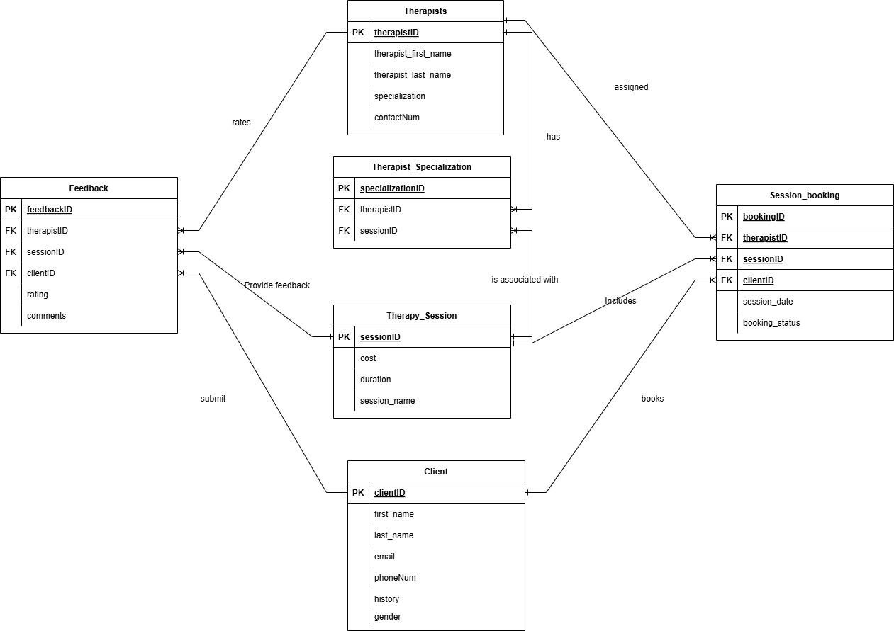

/*
Name: Jashanpreet Kaur 
Project Name: iCare4u – Mental health Support System 
Date: 2024-11-17 
*/

1. Project description: 

iCare4u is an online platform that aims to make mental health services more accessible, efficient, and simple to use. It enables people to communicate with therapists, schedule therapy sessions, and 
provide feedback, all while maintaining privacy and comfort. This project was inspired by the difficulties people face when attempting to locate and schedule appointments with the appropriate 
therapist. ‘iCare4U’ provides hope and guidance to those seeking mental health support. 
iCare4u streamlines the therapeutic journey by allowing users to find a specialised therapist, schedule sessions, and provide feedback on the services. This platform is designed to make the process smoother and more accessible, especially for those who may have difficulty accessing mental health resources.

2. Business Case 

There’s a growing need for mental health services, especially online, as many people struggle with 
mental health issues like anxiety and depression. Traditional therapy can involve long wait times and 
geographical limitations. iCare4u helps solve this by allowing people to (all online): 
    A centralised platform where people can schedule therapy sessions 
    Reduced administrative burden for therapists. 
    Simple access to mental health support. 
    Efficient session management and feedback collection. 
    
The platform goal is to make mental health services more accessible and convenient, especially for 
individuals who prefer remote therapy. iCare4u helps reduce the stigma around seeking help and 
ensures that mental health care Is available to everyone, regardless of location or availability. 

This platform is for: 

    Primary: Individuals looking for mental health support. 
    Secondary: Therapists and counsellors. 
    Tertiary: Mental health clinic administrators 

3. Business Rules/Assumptions 

    A client can book one to many session bookings. 
    A therapist can be assigned to one-to-many session bookings. 
    A therapy session is included in one-to-many session bookings. 
    A client can submit one to many feedback entries. 
    A therapist can receive one to many feedback entries. 
    A therapy session can receive one to many feedback entries. 
    A therapist can have one to many specializations. 
    A therapy session can be associated with one-to-many specializations. 

4. Entity Relationship Diagram

Below is the Entity Relationship Diagram for the iCare4u project:

