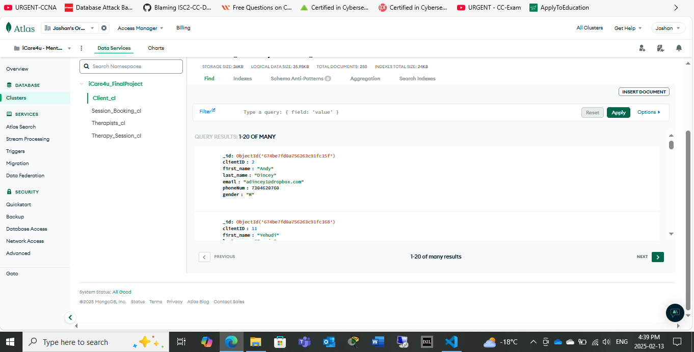

# Cloud Migration & Database Backup Optimization

## Project Overview
This project focuses on migrating a local database to **Google Cloud** using **MongoDB Atlas**, along with implementing backup strategies and index optimizations for **Microsoft SQL Server 2022**.

## Technologies Used
- **Cloud Platform**: Google Cloud (GCP)
- **Database Management**: MongoDB Atlas, Microsoft SQL Server 2022
- **Backup Strategies**: Full, Differential, Incremental
- **Optimization Techniques**: Index Optimization, Query Performance Tuning

## Steps & Implementation
### 1. **Local to Cloud Migration (MongoDB Atlas & GCP)**
- Exported local MongoDB database using `mongodump`.
- Imported the database to **MongoDB Atlas** via `mongorestore`.
- Configured **Google Cloud connectivity** for database access.
- Ensured data consistency post-migration by running validation scripts.## Steps & Implementation
### 1. **Local to Cloud Migration (MongoDB Atlas & GCP)**
- Exported local MongoDB database using `mongodump`.
- Imported the database to **MongoDB Atlas** via `mongorestore`.
- Configured **Google Cloud connectivity** for database access.
- Ensured data consistency post-migration by running validation scripts.

### 2. **Backup Strategies in MongoDB Atlas**
- Implemented **full backups** to ensure complete data safety.
- Configured **differential backups** to store only changed data.
- Set up **incremental backups** for continuous backup cycles.
- Automated backup scheduling via **MongoDB Atlas UI**.

### 3. **Microsoft SQL Server 2022 Backup Automation**
- Scheduled **full database backups** using SQL Server Agent.
- Set up **differential backups** for daily snapshots.
- Configured **incremental (transaction log) backups** to capture real-time changes.
- Verified backup integrity using `RESTORE VERIFYONLY`.

### 4. **Index Optimization & Performance Tuning**
- Analyzed slow queries using SQL Server **Query Execution Plans**.
- Implemented **clustered and non-clustered indexes** to speed up searches.
- Used `DBCC SHOW_STATISTICS` to monitor index fragmentation.
- Scheduled index rebuilding for performance enhancement.

## Results & Key Learnings
✅ **Improved query performance** by **30%** through index optimization.  
✅ **Reduced backup storage cost** by implementing **differential and incremental backups**.  
✅ **Achieved seamless migration** with **zero downtime** for end users.  
✅ **Enhanced disaster recovery plan** with scheduled **automated backups**.

