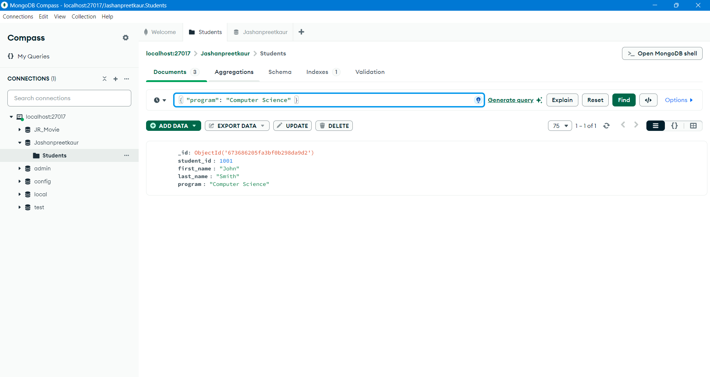

# What You Need to Know:
MongoDB is a NoSQL database, which stands for "Not Only SQL." Unlike traditional relational databases (like MySQL or SQL Server), MongoDB is designed to handle large amounts of unstructured or semi-structured data. It stores data in a format called JSON-like documents, which are more flexible and scalable than the structured tables used in relational databases.

In short, MongoDB is a way to store information that doesn’t need to follow strict rules, just like how you can store all your toys in a big box however you like!

MongoDB Compass is a tool that helps you interact with your MongoDB database in a more visual way. You can connect to your database, view data, add new records, run queries, and more—all with an easy-to-use interface.

# Step-by-Step Guide to MongoDB Compass

Step 1: Download and Install MongoDB Compass
First, you need to install MongoDB Compass if you don’t have it yet. Go to the official MongoDB Compass download page, download the version for your operating system (Windows, macOS, or Linux), and install it.

Step 2: Open MongoDB Compass
Once installed, open MongoDB Compass. You’ll see a window asking for connection details.

Hostname: If you're running MongoDB on your own computer (local machine), you can leave it as localhost or 127.0.0.1.
Port: This is usually 27017 for MongoDB.
Authentication: If you don't have a password, you can leave it blank or use default settings.
Once the details are in place, click Connect.

Step 3: Create a Database
After connecting, you’ll see an empty space if this is your first time.
To create a new database, click on the "Create Database" button. You’ll need to give it a name (e.g., iCare4u) and a collection name (e.g., clients).
Click Create Database. Now you have a database where you can store your data.

Step 4: Create Collections
Collections in MongoDB are like tables in traditional databases.
After creating your database, you can add collections (e.g., clients, therapists, sessions).
Click on your database name (e.g., iCare4u), then click Create Collection.
Give your collection a name (e.g., clients) and click Create.

Step 5: Import JSON Files
You’ve already got your JSON files (data files in a structured format). Now, you want to add this data to MongoDB.
OR
Insert a document.

Go to your collection (e.g., clients).
Click on Add Data, and choose Import File.
Browse for your JSON file (for example, clients.json) and select it.
MongoDB Compass will automatically detect the file format (JSON). Just click Import to add it to the collection.

Step 6: View the Data
Once the data is imported, MongoDB Compass will show you the documents (data entries) in a pretty format.
You can click on Documents at the top to see all the data.
Each document represents one piece of data, like one client or one session. You’ll see the information neatly organized. (Fact: Double-click to see the data type for each)

Step 7: Run Queries
Now, let’s say you want to search for specific data.

On the top, you’ll see a Filter bar. This is where you can write queries (search instructions).
If you want to find clients with a certain clientID, for example, type:

{ "clientID": 1 }
This query will show you all documents where clientID equals 1.

Step 8: Update or Delete Data
If you want to update or delete data:

Update: Click on the pencil/edit icon next to a document to make changes (like changing a client’s name).
Delete: Click on the trash can icon next to a document to remove it.

Step 9: Create Indexes (Optional)
Sometimes, when you have a lot of data, you need to make searches faster. That’s where indexes come in.

Go to the Indexes tab in the collection.
Click on Create Index.
Choose a field you want to index (e.g., clientID) to make searching quicker.

Step 10: Export Data (Optional)
If you want to export your data from MongoDB:

Click on Export Data in the collection.
You can choose to export it in JSON or CSV format.
Click Export, and the file will be saved to your computer.

# Mongo DB
Some common commands to use:

1. show dbs - To show all available databases, won't show if no data in it.
2. use iCare4u - To use this database or create new one if doesn't exist.
3. db.createCollection("clients") - To create a collection. Example: Clients
4. db.clients.insertOne({
  "clientID": 1,
  "firstName": "John",
  "lastName": "Doe",
  "email": "john.doe@example.com"
}) - For inserting data, only one row
5. db.clients.find().pretty() - To show everything avaiable in clients collection in pretty format.
6. db.clients.deleteOne({ "clientID": 1 }) - To delete where clientID is 1.

Here how it looks like in MongoDB Compass:

# MongoDB Compass makes working with MongoDB really simple. By following these steps, you’ll be able to interact with your database without needing to write complicated commands in a terminal. You can import data, run queries, and manage your collections all with a few clicks.

If you ever get stuck, don’t hesitate to ask for help or refer back to the documentation. Happy working with MongoDB Compass!